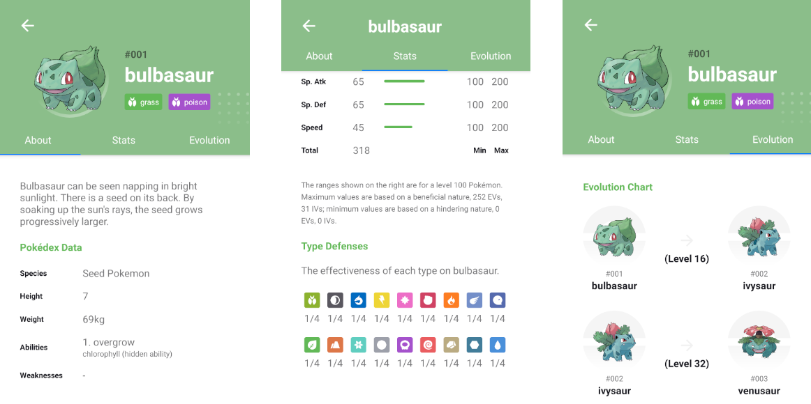

  

<h3 align="center">
<strong>Pokédex - Project based on <a href="https://devchallenge.com.br/challenges/5f35ce77ed30f35c3a399717/details">DevChallenge</a></strong>
</h3>

  
  
  
  
   
   
  <a href="#space_invader-technologies">Technologies</a>
   
   
  <h3 align="center">
    Home
  </h3>
  
   
  <h3 align="center">
    Details
  </h3>
  
   

## :space_invader: Technologies

- [React Native](https://reactnative.dev/)
- [Expo](https://expo.io/)
- Typescript
- [PokéAPI](https://pokeapi.co/)
- [React Navigation](https://reactnavigation.org/)
- [react-native-svg](https://github.com/react-native-svg/react-native-svg)
- [react-native-svg-transformer](https://github.com/kristerkari/react-native-svg-transformer)
- [Modalize](https://github.com/jeremybarbet/react-native-modalize)
- [axios](https://github.com/axios/axios)
- [react-native-reanimated](https://docs.swmansion.com/react-native-reanimated/)
